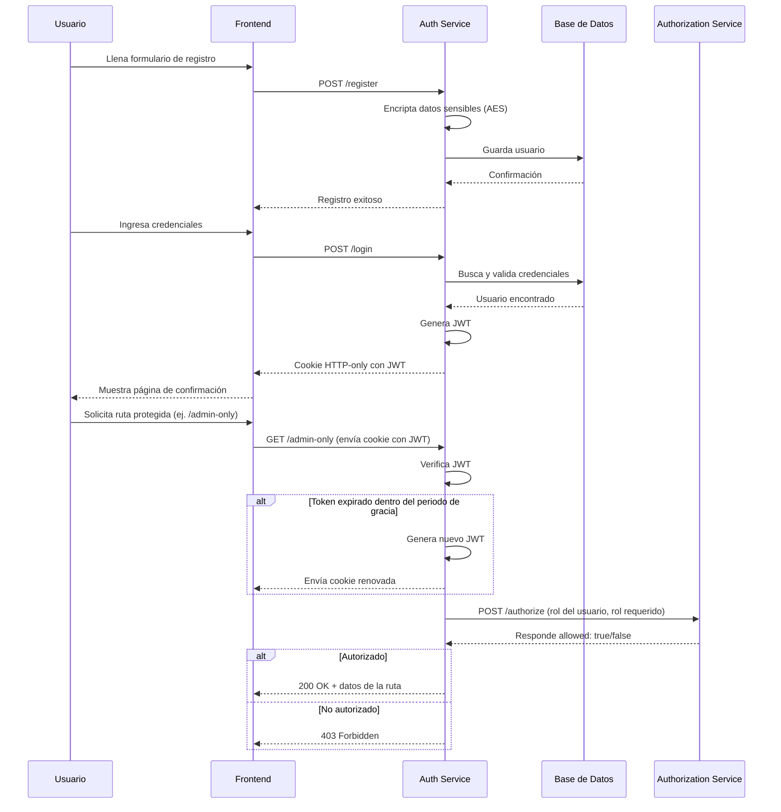

# Práctica 2 — Autenticación y Autorización

Módulo de registro, login y autorización por roles (Admin/Cliente), con autenticación mediante JWT almacenado en cookies HTTP-only y datos sensibles encriptados con AES.

## Tecnologías utilizadas

| Tecnología | Para qué se usa | Ventajas | Desventajas |
|---|---|---|---|
| **Node.js + Express** | Backend (auth-service y authorization-service) | Rápido de levantar, mucha documentación, ideal para APIs REST pequeñas | No es el más eficiente para tareas con mucho cómputo (no es el caso aquí) |
| **PostgreSQL** | Base de datos relacional | Robusto, soporta bien las relaciones y las restricciones de integridad | Requiere más configuración inicial que una base de datos no relacional |
| **jsonwebtoken (JWT)** | Generar y verificar los tokens de sesión | No requiere guardar sesión en el servidor, el token lleva la información firmada | Si el `JWT_SECRET` se filtra, cualquiera puede firmar tokens válidos |
| **bcrypt** | Hashear datos sensibles | Diseñado específicamente para contraseñas, resistente a fuerza bruta | Un poco más lento que otros algoritmos (a propósito, por seguridad) |
| **AES (crypto de Node)** | Encriptar nombre, correo y contraseña en la base de datos | Reversible: se puede desencriptar cuando se necesita el dato original | Si se pierde la llave (`AES_KEY`), los datos encriptados quedan inutilizables |
| **cookie-parser** | Leer y escribir cookies HTTP-only | Simplifica el manejo de cookies en Express | — |
| **cors** | Permitir peticiones del frontend con credenciales | Necesario para que las cookies viajen entre distintos orígenes | Hay que configurarlo con cuidado para no abrir el API a cualquier origen |

## Conceptos clave

### JWT (JSON Web Token)

Es un token firmado digitalmente que contiene información del usuario (en este proyecto: `id` y `role`). El servidor lo genera al hacer login y lo firma con una llave secreta (`JWT_SECRET`). En cada petición a una ruta protegida, el servidor verifica la firma para confirmar que el token no fue alterado, sin necesidad de guardar nada de la sesión en el servidor. Tiene un tiempo de vida configurable (`JWT_EXPIRATION`) y, en este proyecto, un periodo de gracia (`JWT_GRACE_PERIOD`) durante el cual, si el token ya expiró pero no ha pasado mucho tiempo, se genera uno nuevo automáticamente sin pedirle al usuario que vuelva a iniciar sesión.

### Cookies HTTP-only

Son cookies que el navegador guarda pero que **no pueden ser leídas ni modificadas desde JavaScript** en el lado del cliente (por ejemplo, no aparecen si se ejecuta `document.cookie` en la consola). Esto protege el JWT de ataques tipo XSS, donde un script malicioso intenta robar el token. En este proyecto, la cookie se llama `token` y se configura con `httpOnly: true` al hacer login.

### AES (Advanced Encryption Standard)

Es un algoritmo de cifrado simétrico: la misma llave (`AES_KEY`) que se usa para encriptar un dato se usa también para desencriptarlo. Se usa para proteger nombre, correo y contraseña en la base de datos, de forma que si alguien accede directamente a la base de datos no pueda leer esta información en texto plano.

## Instrucciones de ejecución

### Requisitos previos
- Node.js 18 o superior
- PostgreSQL corriendo localmente (o accesible por red)

### 1. Clonar el repositorio
```bash
git clone <URL_DEL_REPOSITORIO>
cd P2
```

### 2. Configurar la base de datos
Crear la base de datos y la tabla `usuarios`:
```sql
CREATE DATABASE practica2;

CREATE TABLE usuarios (
  id SERIAL PRIMARY KEY,
  nombre TEXT NOT NULL,
  correo TEXT NOT NULL,
  password TEXT NOT NULL,
  rol VARCHAR(20) NOT NULL DEFAULT 'Cliente'
);
```

### 3. Levantar el `auth-service`
```bash
cd auth-service
npm install
```
Crear un archivo `.env` con:
```
PORT=3001
DB_HOST=localhost
DB_PORT=5432
DB_NAME=practica2
DB_USER=postgres
DB_PASSWORD=<tu_contraseña>
JWT_SECRET=<tu_secreto>
JWT_EXPIRATION=15m
JWT_GRACE_PERIOD=5m
AES_KEY=<llave_de_32_caracteres>
AUTH_SERVICE_URL=http://localhost:3002
MAX_RETRIES=3
RETRY_BACKOFF=500
```
Iniciar el servicio:
```bash
node app.js
```

### 4. Levantar el `authorization-service` (en otra terminal)
```bash
cd authorization-service
npm install
node app.js
```

> **Importante:** los dos servicios deben estar corriendo al mismo tiempo, en terminales separadas, para que las rutas protegidas por rol funcionen.

### 5. Probar los endpoints
| Método | Ruta | Descripción |
|---|---|---|
| POST | `/register` | Registra un nuevo usuario |
| POST | `/login` | Inicia sesión y entrega la cookie con el JWT |
| GET | `/me` | Devuelve los datos del usuario autenticado |
| GET | `/dashboard` | Ruta protegida, accesible por Admin y Cliente |
| GET | `/admin-only` | Ruta protegida, accesible solo por Admin |

## Diagrama de secuencia del flujo



## Principios SOLID aplicados

### S — Responsabilidad Única (Single Responsibility)

Cada archivo tiene una sola razón para cambiar. `authorization.client.js` solo se encarga de comunicarse con el `authorization-service` (armar la petición, reintentar con backoff), sin mezclarse con la verificación del JWT:

```javascript
async function authorizeWithRetry({ role, requiredRole }) {
  const serviceUrl = process.env.AUTH_SERVICE_URL || 'http://localhost:3002';
  const { maxRetries, backoff } = getRetryConfig();
  // intenta la petición hasta maxRetries veces
}
```

`auth.middleware.js`, en cambio, solo se encarga de verificar el token y decidir si la petición continúa, delegando la validación del rol a `authorizeWithRetry` en vez de implementarla él mismo.

### O — Abierto/Cerrado (Open/Closed)

El middleware de autenticación está **cerrado a modificación** pero **abierto a extensión**: es una función que recibe el rol requerido como parámetro, así que se pueden proteger nuevas rutas con distintos roles sin tocar el código del middleware:

```javascript
router.get('/admin-only', authMiddleware('Admin'), (req, res) => { ... });
router.get('/dashboard', authMiddleware(), (req, res) => { ... });
```

Si mañana se agrega un tercer rol (por ejemplo `Supervisor`), solo se necesita declarar una nueva ruta con `authMiddleware('Supervisor')`, sin modificar la función `authMiddleware`.

### L — Sustitución de Liskov (Liskov Substitution)

En `login`, la validación de la contraseña se intenta primero por desencriptación AES y, si falla, se compara con `bcrypt.compare` como alternativa:

```javascript
try {
  isValid = decrypt(user.password) === password;
} catch (error) {
  isValid = await bcrypt.compare(password, user.password);
}
```

La idea detrás de este bloque es que ambas estrategias de validación son intercambiables desde el punto de vista de quien las llama: a `login` no le importa cuál de las dos se usó, solo espera un booleano de vuelta. *(Nota: como el registro guarda la contraseña encriptada con AES, en la práctica la rama de `bcrypt.compare` no llega a ejecutarse — ver observación al final.)*

### I — Segregación de Interfaces (Interface Segregation)

Las rutas dependen únicamente de las funciones que necesitan, no de un objeto grande con métodos que no usan. `auth.routes.js` importa solo `register` y `login` desde el controlador, y solo `authMiddleware` desde su archivo correspondiente — cada módulo expone una interfaz mínima y específica en vez de forzar a quien lo consume a depender de más de lo necesario:

```javascript
const { register, login } = require('../controllers/auth.controller');
const authMiddleware = require('../middlewares/auth.middleware');
```

### D — Inversión de Dependencias (Dependency Inversion)

`auth.middleware.js` no sabe *cómo* se valida un rol (no arma peticiones HTTP ni maneja reintentos); depende únicamente de la abstracción `authorizeWithRetry`:

```javascript
const { authorizeWithRetry } = require('../services/authorization.client');
// ...
authorizeWithRetry({ role: decoded.role, requiredRole })
  .then((allowed) => { ... })
  .catch(() => res.status(503).json({ ok: false, message: 'No se pudo validar la autorización' }));
```

Si la forma de validar el rol cambiara en el futuro, solo se modificaría `authorization.client.js`, sin tocar el middleware.
