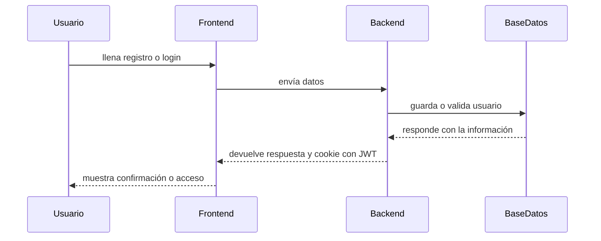

# Auth Service

Este proyecto es el backend de la práctica 2. Aquí se hace el registro, el login, la autenticación con JWT y el control de acceso por roles.

## Cómo ejecutar el proyecto

1. Entrar a la carpeta del servicio:

```bash
cd P2/auth-service
```

2. Instalar las dependencias:

```bash
npm install
```

3. Crear la base de datos y la tabla con PostgreSQL:

```bash
psql -U postgres -f schema.sql
```

4. Crear un archivo .env con estas variables:

```env
PORT=3001
DB_HOST=localhost
DB_PORT=5432
DB_NAME=auth_practice
DB_USER=postgres
DB_PASSWORD=tu_contraseña
JWT_SECRET=mi_secreto
JWT_EXPIRATION=15m
JWT_GRACE_PERIOD=5m
AES_KEY=mi_clave_de_32_caracteres
```

5. Iniciar el servicio:

```bash
npm run dev
```

Si todo sale bien, el servicio quedará en http://localhost:3001.

## Endpoints principales

- POST /register: crea un usuario nuevo.
- POST /login: valida correo y contraseña y genera el token.
- GET /me: devuelve la información del usuario autenticado.
- GET /admin-only: solo para administradores.
- GET /dashboard: para admin y cliente.
- GET /health: verifica que el servicio esté vivo.

## Qué hace este proyecto

- El registro guarda el nombre y el correo cifrados con AES.
- La contraseña se guarda hasheada con bcrypt.
- El login genera un JWT y lo envía en una cookie HTTP-only.
- El middleware revisa si el token expiró y, si todavía está dentro del tiempo de gracia, lo renueva.
- Hay rutas protegidas según el rol del usuario.

## JWT, AES y cookies HTTP-only

### JWT
Es un token que sirve para identificar al usuario. Se usa para decir “este usuario ya pasó la autenticación”.

Ventajas:
- Es rápido de validar.
- Sirve para mantener la sesión sin guardar datos enormes.

Desventajas:
- Si alguien lo consigue, puede usarlo si no está bien protegido.
- Si expira, hay que renovarlo o volver a iniciar sesión.

### AES
Es un método para cifrar datos sensibles como el nombre y el correo.

Ventajas:
- Ayuda a proteger la información en la base de datos.
- Hace más difícil que alguien lea esos datos si entra a la base de datos.

Desventajas:
- Si se pierde la llave de cifrado, ya no se puede recuperar lo que estaba guardado.
- Hay que manejar bien la llave y no dejarla expuesta.

### Cookies HTTP-only
Son cookies que no se pueden leer desde JavaScript del navegador. Eso ayuda a que el token no quede fácil de robar desde el frontend.

Ventajas:
- Son más seguras que guardar el token en localStorage.
- Evitan que scripts del navegador accedan al token fácilmente.

Desventajas:
- No se pueden leer desde el frontend con JavaScript.
- Hay que manejar bien el mismo sitio y la configuración de seguridad.

## Diagrama de secuencia



## Principios SOLID en este proyecto

No es un proyecto perfecto, pero sí se ve una organización básica de estos principios.

### 1. Principio de responsabilidad única
Cada archivo tiene una tarea clara.
- [src/controllers/auth.controller.js](src/controllers/auth.controller.js) maneja el registro y el login.
- [src/middlewares/auth.middleware.js](src/middlewares/auth.middleware.js) solo valida el token y los permisos.
- [src/config/db.js](src/config/db.js) solo se encarga de la conexión con PostgreSQL.

### 2. Principio abierto/cerrado
La lógica del middleware se puede reutilizar para distintas rutas sin tener que cambiar su base.
Por ejemplo, en [src/routes/auth.routes.js](src/routes/auth.routes.js) se usa el mismo middleware para rutas diferentes, una para admins y otra para admin y cliente.

### 3. Principio de sustitución de Liskov
El middleware funciona de forma consistente aunque cambie el rol que se le pasa.
Eso permite usar la misma lógica para distintos casos sin romper el comportamiento esperado.

### 4. Principio de segregación de interfaces
No se creó un middleware gigante que haga todo. Se separó lo que es autenticación, autorización y manejo de la base de datos.
Eso hace más fácil entender y mantener el proyecto.

### 5. Principio de inversión de dependencias
La app depende de módulos pequeños y organizados, en vez de tener todo metido en un solo archivo.
Se ve en [src/app.js](src/app.js), que usa [src/routes/index.js](src/routes/index.js) y la configuración de base de datos desde [src/config/db.js](src/config/db.js).

## Archivos importantes

- [src/app.js](src/app.js): inicia el servidor.
- [src/controllers/auth.controller.js](src/controllers/auth.controller.js): lógica de registro y login.
- [src/middlewares/auth.middleware.js](src/middlewares/auth.middleware.js): valida el token y controla permisos.
- [src/routes/auth.routes.js](src/routes/auth.routes.js): define las rutas del servicio.
- [schema.sql](schema.sql): crea la base de datos y la tabla de usuarios.
