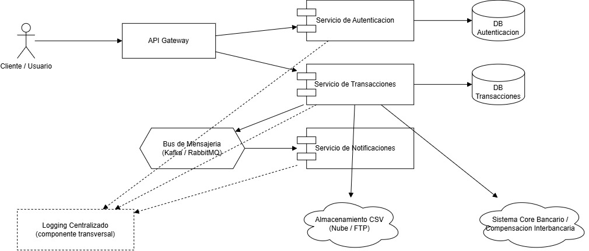
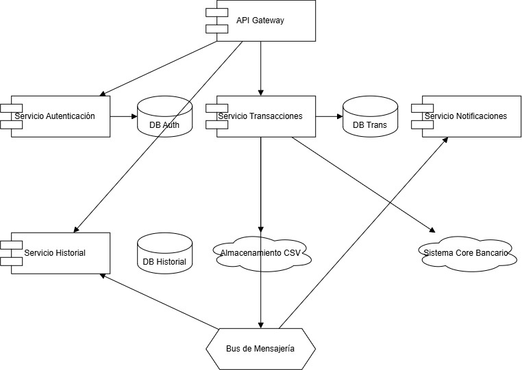

# Práctica 3 — Diseño de Arquitectura de Microservicios

## Contexto
El banco actualmente tiene un sistema monolítico que presenta problemas de rendimiento en épocas de alta demanda. Esta práctica propone una arquitectura basada en microservicios para reemplazarlo.

---

## 📐 Diagramas

### Arquitectura General

### Diagrama de Componentes

---

### Diagramas ER

| Microservicio | Diagrama |
|---------------|----------|
| Autenticación |  |
| Transacciones |  |
| Notificaciones |  |

---

### Diagramas de Clases UML

| Microservicio | Diagrama |
|---------------|----------|
| Autenticación |  |
| Transacciones |  |
| Notificaciones |  |

---

### Diagramas de Secuencia UML

| Flujo | Diagrama |
|-------|----------|
| Aprobación 3 pasos |  |
| Envío al Core Bancario |  |
| Notificación a Clientes |  |

---

## 📄 Documentación

- [Microservicios](./documentacion/microservicios.md)
- [Flujo de aprobación](./documentacion/flujo-aprobacion.md)
- [Estrategia de almacenamiento CSV](./documentacion/almacenamiento-csv.md)
- [Estrategia de logging centralizado](./documentacion/logging.md)
- [Comunicación entre servicios](./documentacion/comunicacion-servicios.md)
- [Propuesta de API Gateway](./documentacion/api-gateway.md)
- [Tecnologías y patrones](./documentacion/tecnologias-patrones.md)

---

## 🛠️ Tecnologías y patrones
Ver [`documentacion/tecnologias-patrones.md`](./documentacion/tecnologias-patrones.md)