# Práctica 5 — Orquestación avanzada de microservicios en Kubernetes con Helm

## Información general

**Curso:** Software Avanzado  
**Práctica:** Práctica 5  
**Tema:** Orquestación avanzada de microservicios en Kubernetes con Helm  

> Escribir aquí, con palabras propias, una breve explicación del objetivo de la práctica.

---

# 1. Arquitectura de la solución

La solución parte de la arquitectura de microservicios desarrollada previamente y la despliega sobre Kubernetes utilizando Helm como mecanismo principal de instalación, actualización y rollback.

La plataforma está formada por:

- Auth Service
- Cursos Service
- Estudiantes Service
- Inscripciones Service
- API Gateway
- PostgreSQL
- RabbitMQ
- Consumer de inscripciones
- CronJobs
- NGINX Ingress Controller

Todos los componentes de la práctica se despliegan en el namespace:

```text
sa-p5
```

## Arquitectura general


## Diagrama de despliegue Kubernetes


## Flujo asíncrono con RabbitMQ


## Modelo entidad-relación


---

# 2. Tecnologías utilizadas

| Tecnología | Uso |
|---|---|
| Kubernetes | Orquestación de contenedores |
| Minikube | Clúster Kubernetes local |
| Helm 3 | Gestión y versionamiento de despliegues |
| Docker | Construcción de imágenes |
| PostgreSQL | Base de datos |
| RabbitMQ | Comunicación asíncrona |
| NGINX Ingress | Punto de entrada HTTP |
| Node.js / Express | Auth, Cursos y Gateway |
| Python / FastAPI | Estudiantes e Inscripciones |
| GraphQL | API de Estudiantes e Inscripciones |
| k6 | Pruebas de carga |
| Calico | NetworkPolicies |

---

# 3. Microservicios

| Componente | Tecnología | Puerto |
|---|---|---:|
| Auth Service | Node.js / Express | 3001 |
| Cursos Service | Node.js / Express | 3002 |
| Inscripciones Service | Python / FastAPI / GraphQL | 3003 |
| Estudiantes Service | Python / FastAPI / GraphQL | 3004 |
| Gateway | Node.js / Express | 3000 |

Los servicios internos utilizan `ClusterIP`. PostgreSQL, RabbitMQ y los microservicios no se exponen directamente hacia el exterior.

El único punto de entrada de la plataforma es el Gateway mediante NGINX Ingress.

---

# 4. Estructura del proyecto

```text
P5/
├── auth-service/
├── cursos-service/
├── estudiantes-service/
├── inscripciones-service/
├── gateway/
├── cronjobs/
├── database/
├── charts/
│   ├── auth-service/
│   ├── cursos-service/
│   ├── estudiantes-service/
│   ├── inscripciones-service/
│   ├── gateway/
│   └── sa-platform/
├── load-tests/
│   └── load-test.js
└── documentacion/
    ├── diagramas/
    └── evidencias/
```

---

# 5. Helm

El despliegue completo de la plataforma se realiza utilizando Helm.

El chart principal es:

```text
P5/charts/sa-platform
```

Este chart utiliza los siguientes subcharts:

```text
auth-service
cursos-service
estudiantes-service
inscripciones-service
gateway
```

También incluye PostgreSQL y RabbitMQ como dependencias.

## Archivos Values

Se utilizan los siguientes archivos:

```text
values.yaml
values-dev.yaml
values-prod.yaml
values.example.yaml
```

`values-dev.yaml` y `values-prod.yaml` permiten variar valores como:

- réplicas
- recursos
- tag de imagen
- nivel de logs

Las credenciales locales se almacenan en:

```text
values-secret.yaml
```

Este archivo está excluido del repositorio mediante `.gitignore`.

---

## Helm Lint

El chart fue validado mediante:

```powershell
helm lint P5\charts\sa-platform `
  -f P5\charts\sa-platform\values-dev.yaml `
  -f P5\charts\sa-platform\values-secret.yaml
```

Resultado:

```text
1 chart(s) linted, 0 chart(s) failed
```

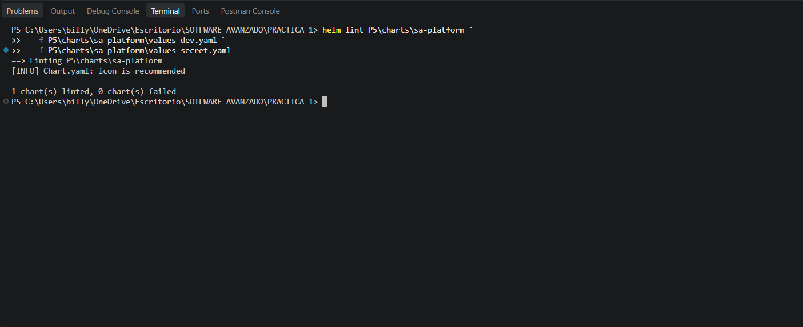

---

# 6. Versionamiento, Upgrade y Rollback

El chart utiliza versionamiento tanto de `version` como de `appVersion`.

Durante las pruebas se utilizaron las versiones:

```text
1.0.0
1.0.1
```

Se realizaron actualizaciones utilizando:

```powershell
helm upgrade sa-platform P5\charts\sa-platform `
  -f P5\charts\sa-platform\values-dev.yaml `
  -f P5\charts\sa-platform\values-secret.yaml
```

El historial puede consultarse mediante:

```powershell
helm history sa-platform
```

También se realizó un rollback hacia una revisión anterior:

```powershell
helm rollback sa-platform <REVISION>
```

La revisión 13 corresponde al upgrade a `1.0.1` y posteriormente se registró un rollback en el historial de Helm.

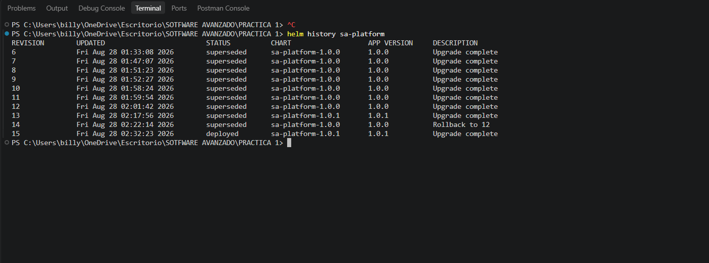

> Explicar aquí, brevemente y con palabras propias, qué ventaja proporciona poder regresar a una revisión anterior.

---

# 7. Namespace administrado por Helm

El namespace utilizado por la plataforma es:

```text
sa-p5
```

El namespace se encuentra definido dentro del propio chart y no necesita ser creado manualmente con `kubectl`.

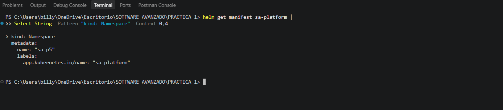

---

# 8. Estado general de la plataforma

La plataforma fue desplegada correctamente dentro del namespace `sa-p5`.

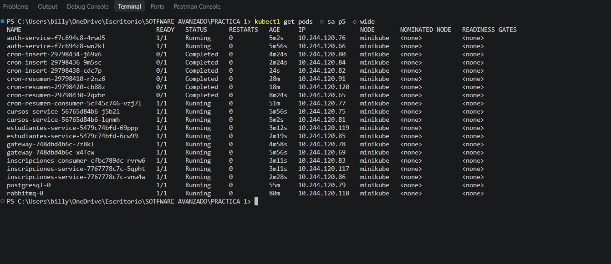

---

# 9. Servicios ClusterIP

Los servicios internos utilizan `ClusterIP`.

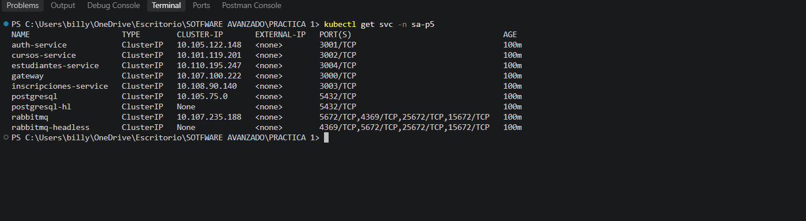

Esto evita exponer directamente:

- microservicios
- PostgreSQL
- RabbitMQ

---

# 10. Ingress

Se utiliza NGINX Ingress como punto de entrada a la plataforma.

El host configurado es:

```text
academia.local
```

La petición al endpoint:

```text
/health
```

respondió correctamente desde el Gateway.

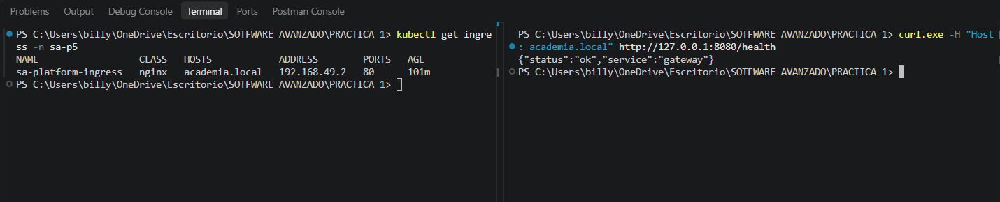

---

# 11. NetworkPolicies

Se implementaron NetworkPolicies utilizando una estrategia restrictiva.

Entre las políticas se encuentran:

```text
default-deny
allow-dns
allow-ingress-to-gateway
gateway-egress
microservices-from-gateway
microservices-to-postgresql
postgresql-from-services
inscripciones-to-rabbitmq
rabbitmq-from-authorized-services
cron-workloads-egress
cron-consumer-egress
```

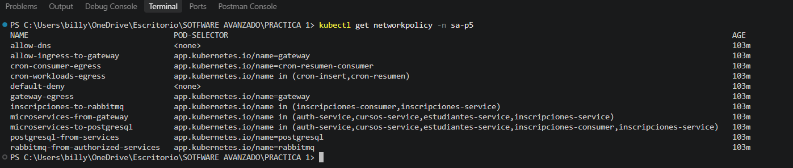

## Prueba de bloqueo

Se creó temporalmente un pod no autorizado e intentó conectarse a PostgreSQL.

El resultado fue:

```text
psql: error: connection to server at "postgresql", port 5432 failed:
timeout expired
```

Esto demuestra que un pod no autorizado no puede comunicarse con PostgreSQL.

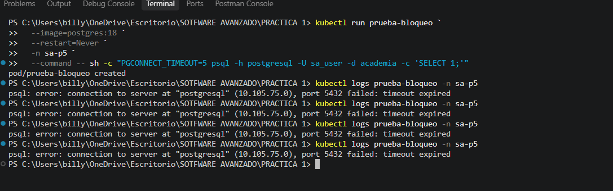

> Explicar aquí, con palabras propias, por qué una política `default-deny` mejora la seguridad.

---

# 12. PostgreSQL y persistencia

PostgreSQL se ejecuta utilizando un `StatefulSet`.

El almacenamiento persistente utiliza un PVC de:

```text
1 Gi
```

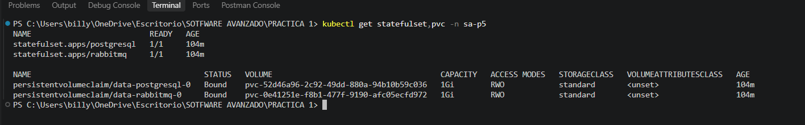

## Prueba de persistencia

Se insertó un registro identificado como:

```text
EVIDENCIA-PVC
```

Posteriormente se eliminó el pod:

```text
postgresql-0
```

Kubernetes recreó automáticamente el pod y, después de volver al estado `Ready`, se realizó nuevamente la consulta.

El registro continuó almacenado:

```text
57 | EVIDENCIA-PVC | 2026-08-28 09:08:47.427494
```

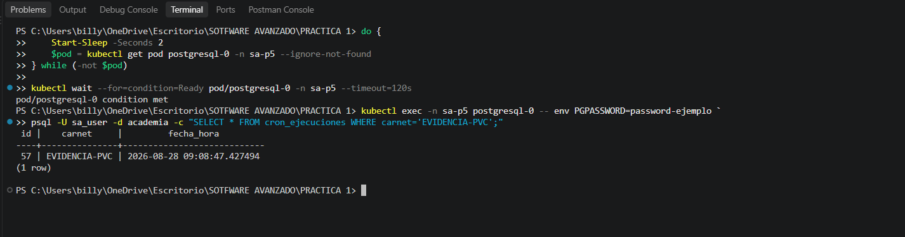

Esto permite comprobar que los datos no dependen del ciclo de vida del pod.

---

# 13. RabbitMQ

RabbitMQ se utiliza como broker de mensajes para comunicación asíncrona.

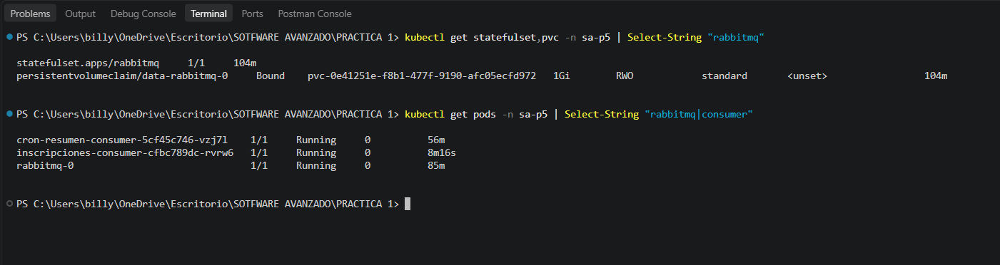

La cola utilizada para las inscripciones es:

```text
inscripciones.events
```

La cola se configura como durable y los mensajes publicados son persistentes.

---

## Productor

Cuando se crea una inscripción, el servicio de inscripciones almacena la información correspondiente y publica un evento en RabbitMQ.

El productor no necesita esperar a que el consumidor termine de procesar el evento.

---

## Consumer

El consumer procesa los eventos de manera independiente.

Se utiliza:

```text
auto_ack = false
```

El ACK únicamente se realiza después de finalizar correctamente el procesamiento.

---

## Prueba con Consumer apagado

Se redujeron temporalmente las réplicas del consumer a `0`.

Después se generaron tres nuevas inscripciones:

```text
ID 4
ID 5
ID 6
```

RabbitMQ mostró:

```text
inscripciones.events    3    0
```

Los tres mensajes permanecieron esperando dentro de la cola.

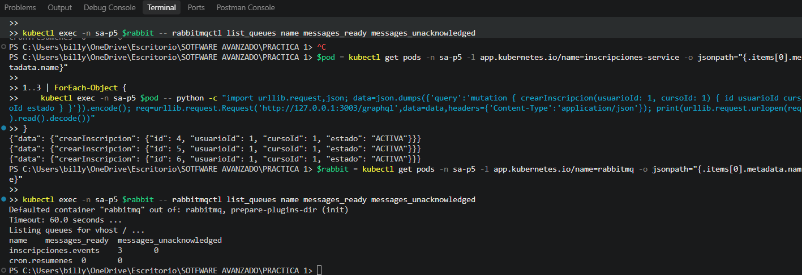

---

## Restauración del Consumer

Después de restaurar el consumer, RabbitMQ mostró:

```text
inscripciones.events    0    0
```

Los tres eventos fueron almacenados correctamente en:

```text
eventos_inscripciones
```

Resultados:

```text
inscripcion_id 4 -> inscripcion.creada
inscripcion_id 5 -> inscripcion.creada
inscripcion_id 6 -> inscripcion.creada
```

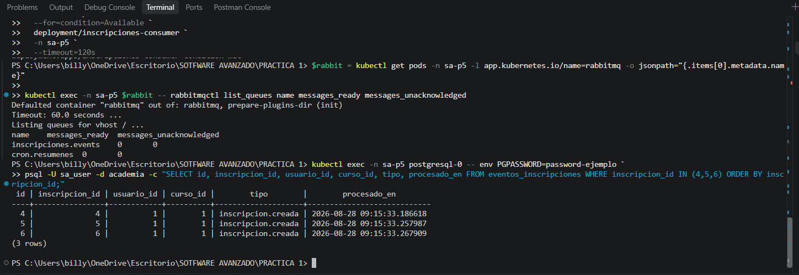

Esto demuestra que los mensajes pueden acumularse mientras el consumidor está fuera de servicio y procesarse posteriormente sin pérdida.

---

# 14. CronJobs

Se implementaron dos CronJobs principales.

| CronJob | Frecuencia | Función |
|---|---|---|
| CronJob 1 | Cada 2 minutos | Inserta un registro con fecha y hora GMT-6 |
| CronJob 2 | Cada 10 minutos | Consulta los registros, genera un resumen y lo publica en RabbitMQ |

Los CronJobs utilizan:

```text
concurrencyPolicy: Forbid
```

También se configuraron:

```text
backoffLimit
successfulJobsHistoryLimit
failedJobsHistoryLimit
```

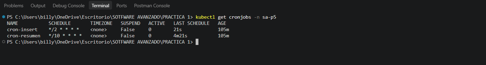

Las ejecuciones generadas pueden observarse en:

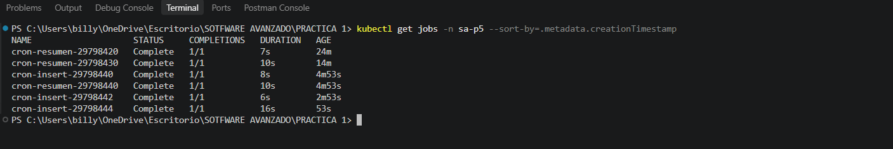

---

# 15. Horizontal Pod Autoscaler

Los microservicios principales cuentan con HPA.

Configuración:

```text
Mínimo: 2 pods
Máximo: 5 pods
CPU objetivo: 70 %
```

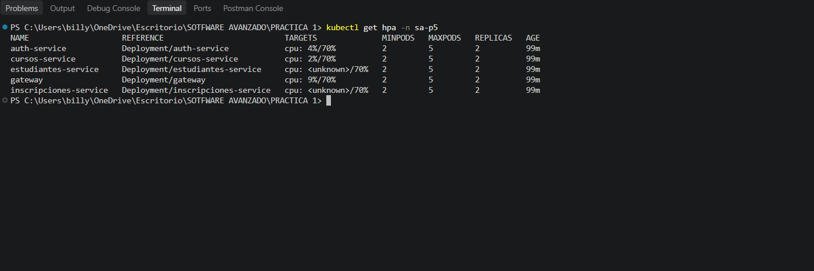

## Escalamiento observado

Durante la prueba de carga, el Gateway aumentó automáticamente sus réplicas.

Se observó la secuencia:

```text
2 -> 4 -> 5
```

Posteriormente, cuando disminuyó la carga:

```text
5 -> 2
```

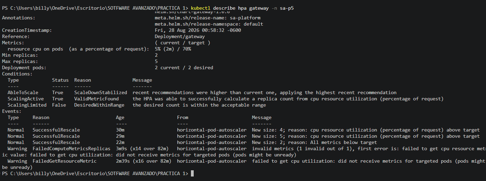

> Explicar aquí, brevemente y con palabras propias, qué relación existe entre el consumo de CPU y el aumento de réplicas.

---

# 16. PodDisruptionBudget

Se configuraron PodDisruptionBudgets para los microservicios.

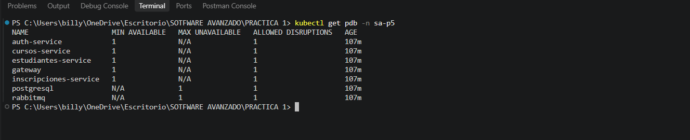

La configuración utiliza:

```text
minAvailable: 1
```

Esto ayuda a mantener al menos una instancia disponible durante interrupciones voluntarias.

---

# 17. ResourceQuota y LimitRange

El namespace cuenta con límites sobre el consumo total de recursos.

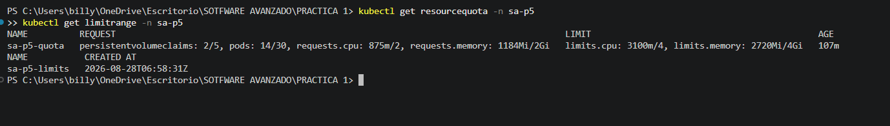

Se utilizan:

```text
ResourceQuota
LimitRange
```

> Explicar aquí con palabras propias la diferencia entre limitar recursos globales del namespace y establecer valores predeterminados por contenedor.

---

# 18. RBAC y ServiceAccounts

Cada microservicio utiliza una ServiceAccount dedicada.

Los CronJobs también cuentan con cuentas independientes.

Se implementaron:

```text
ServiceAccount
Role
RoleBinding
```

siguiendo el principio de mínimo privilegio.

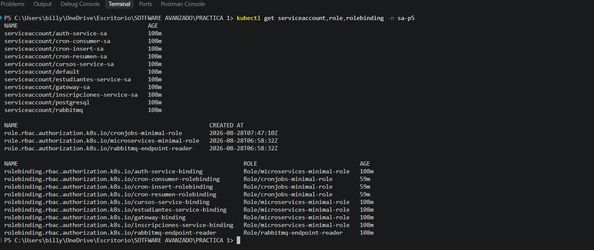

---

# 19. SecurityContext y Probes

Los contenedores utilizan configuraciones de seguridad como:

```yaml
runAsNonRoot: true
readOnlyRootFilesystem: true
allowPrivilegeEscalation: false
```

También cuentan con:

```text
startupProbe
readinessProbe
livenessProbe
```

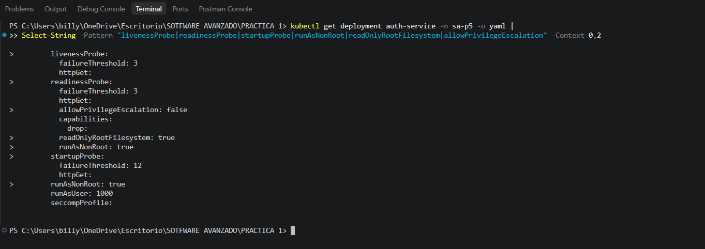

---

# 20. Rolling Update sin downtime

El Gateway utiliza estrategia:

```text
RollingUpdate
```

con:

```text
maxUnavailable: 0
```

Para verificar disponibilidad se enviaron 300 peticiones mientras Helm realizaba un upgrade.

Resultado:

```text
PETICIONES_OK       : 300
PETICIONES_FALLIDAS : 0
```

El Deployment finalizó correctamente:

```text
deployment "gateway" successfully rolled out
```

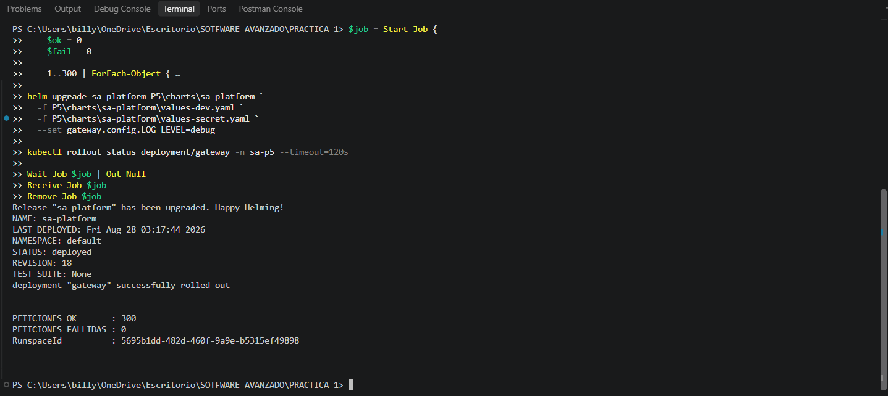

La prueba permitió verificar que el Gateway continuó respondiendo durante el proceso de actualización.

---

# 21. Prueba de carga con k6

El script utilizado se encuentra en:

```text
P5/load-tests/load-test.js
```

La prueba aumenta progresivamente la concurrencia hasta:

```text
300 usuarios virtuales
```

## Resultados

| Métrica | Resultado |
|---|---:|
| Solicitudes totales | 36,846 |
| Throughput | ~306.92 req/s |
| p95 | 1.05 s |
| Errores HTTP | ~0.00 % |
| VUs máximos | 300 |

El threshold configurado para errores fue satisfecho.

El threshold:

```text
p95 < 1000 ms
```

no se alcanzó, debido a que el resultado real fue aproximadamente:

```text
1.05 s
```

Esta diferencia se reporta como parte de los resultados reales de la prueba.

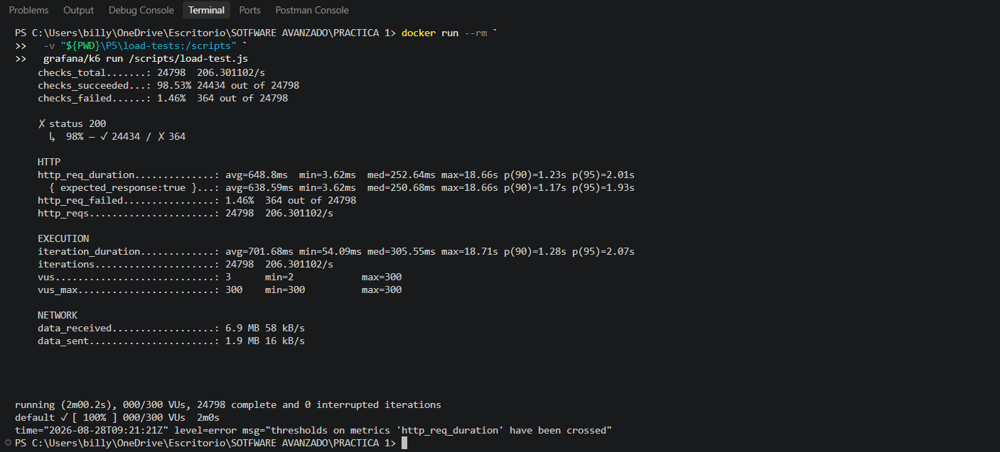

---

# 22. Optimización de imágenes Docker

Los servicios utilizan Dockerfiles optimizados con builds multi-stage y bases reducidas como:

```text
node:22-alpine
python:3.12-slim
```

## Comparación P4 vs P5

| Servicio | P4 | P5 | Reducción |
|---|---:|---:|---:|
| Gateway | 250 MB | 247 MB | 1.20 % |
| Auth Service | 251 MB | 247 MB | 1.59 % |
| Cursos Service | 250 MB | 245 MB | 2.00 % |
| Estudiantes Service | 274 MB | 261 MB | 4.74 % |
| Inscripciones Service | 274 MB | 263 MB | 4.01 % |
| **TOTAL** | **1299 MB** | **1263 MB** | **2.77 %** |

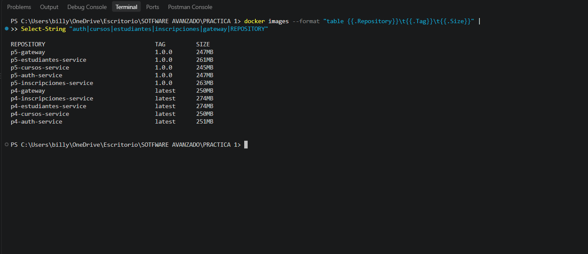

---

# 23. ConfigMaps y Secrets

La configuración no sensible se almacena en ConfigMaps.

Las credenciales se proporcionan mediante Kubernetes Secrets.

El archivo:

```text
P5/charts/sa-platform/values-secret.yaml
```

contiene los valores locales y se encuentra ignorado mediante `.gitignore`.

Para configurar una instalación nueva debe utilizarse como referencia:

```text
values.example.yaml
```

No se deben almacenar credenciales reales dentro del repositorio.

---

# 24. Instalación desde un clúster vacío

## Requisitos

Se requiere tener instalados:

```text
Docker
Minikube
kubectl
Helm 3
```

---

## 24.1 Iniciar Minikube

```powershell
minikube start --driver=docker --cpus=2 --memory=3072 --cni=calico
```

---

## 24.2 Agregar repositorio Bitnami

```powershell
helm repo add bitnami https://charts.bitnami.com/bitnami
helm repo update
```

---

## 24.3 Resolver dependencias

```powershell
helm dependency update P5\charts\sa-platform
```

---

## 24.4 Configurar secretos

Crear:

```text
P5/charts/sa-platform/values-secret.yaml
```

utilizando:

```text
P5/charts/sa-platform/values.example.yaml
```

como referencia.

El archivo `values-secret.yaml` no debe agregarse al repositorio.

---

## 24.5 Instalar plataforma

Desde la raíz del repositorio:

```powershell
helm install sa-platform P5\charts\sa-platform `
  -f P5\charts\sa-platform\values-dev.yaml `
  -f P5\charts\sa-platform\values-secret.yaml
```

No es necesario crear manualmente el namespace `sa-p5`, debido a que forma parte del chart.

---

## 24.6 Actualizar plataforma

```powershell
helm upgrade sa-platform P5\charts\sa-platform `
  -f P5\charts\sa-platform\values-dev.yaml `
  -f P5\charts\sa-platform\values-secret.yaml
```

---

## 24.7 Consultar historial

```powershell
helm history sa-platform
```

---

## 24.8 Realizar rollback

```powershell
helm rollback sa-platform <REVISION>
```

---

# 25. Evidencias

Las evidencias de ejecución se encuentran en:

```text
P5/documentacion/evidencias/
```

Entre las evidencias se incluyen:

```text
01-helm-lint.png
02-helm-history-rollback.png
03-hpa-scale-up-down.png
04-hpa-microservicios.png
05-pods-plataforma.png
06-servicios-clusterip.png
07-ingress-gateway.png
08-networkpolicies.png
09-networkpolicy-bloqueo.png
10-postgresql-pvc.png
11-persistencia-despues-borrar-pod.png
12-rabbitmq-consumer.png
13-rabbitmq-mensajes-acumulados.png
14-rabbitmq-mensajes-procesados.png
15-cronjobs.png
16-cronjobs-ejecuciones.png
17-resourcequota-limitrange.png
18-pdb-microservicios.png
19-rbac-serviceaccounts.png
20-rollingupdate-cero-downtime.png
21-k6-resultados.png
22-probes-securitycontext.png
23-namespace-creado-helm.png
24-tamanos-imagenes-docker.png
```

---

# 26. Diagramas

Los diagramas se encuentran en:

```text
P5/documentacion/diagramas/
```

Incluyen:

```text
Arquitectura General
Despliegue Kubernetes
Flujo Asíncrono con RabbitMQ
Modelo ER P5
```

---
