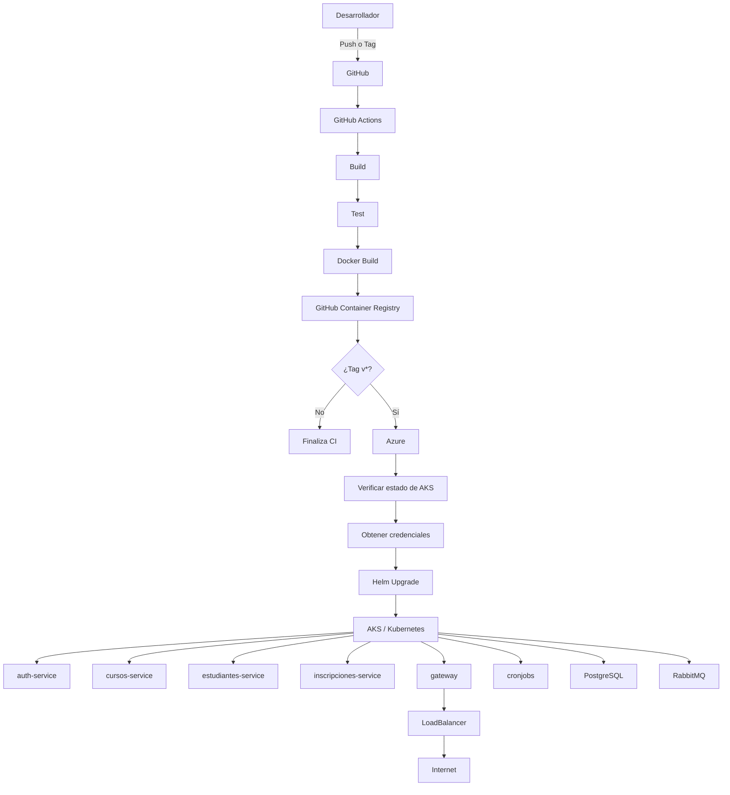

# Diagrama CI/CD - Práctica 7

```mermaid
flowchart TD
    A[Desarrollador] -->|Push o Tag| B[GitHub]
    B --> C[GitHub Actions]

    C --> D[Build]
    D --> E[Test]

    E --> F[Docker Build]
    F --> G[GitHub Container Registry]

    G --> H{¿Tag v*?}

    H -->|No| I[Finaliza CI]
    H -->|Sí| J[Azure]

    J --> K[Verificar estado de AKS]
    K --> L[Obtener credenciales]
    L --> M[Helm Upgrade]
    M --> N[AKS / Kubernetes]

    N --> O[auth-service]
    N --> P[cursos-service]
    N --> Q[estudiantes-service]
    N --> R[inscripciones-service]
    N --> S[gateway]
    N --> T[cronjobs]

    N --> U[PostgreSQL]
    N --> V[RabbitMQ]

    S --> W[LoadBalancer]
    W --> X[Internet]
```