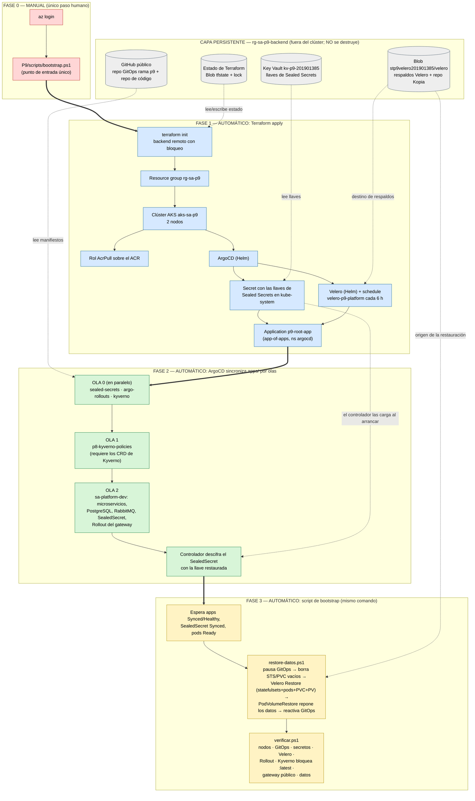

# Diagrama del bootstrap: orden de reconstrucción y dependencias

Muestra **en qué orden** se reconstruye el sistema tras perder el clúster, **de qué depende cada componente** y
**qué es automático y qué es manual**. El diagrama se dibuja con Mermaid (GitHub lo renderiza directamente);
la versión PlantUML equivalente está en [diagrama-bootstrap.puml](diagrama-bootstrap.puml).

**Leyenda:** 🟥 manual (operador) · 🟦 automático, Terraform · 🟩 automático, ArgoCD (app-of-apps) · 🟨 automático, script de
bootstrap · ⬜ capa persistente (sobrevive al desastre; no se reconstruye, se **lee**).

## Dependencias que fuerzan el orden

| Componente | Debe existir antes | Por qué |
|---|---|---|
| ArgoCD | AKS | Se instala con Helm dentro del clúster. |
| Llaves de Sealed Secrets | ArgoCD (namespace), AKS | El controlador solo carga al arrancar las llaves que ya están en `kube-system`; si arranca sin ellas genera una llave nueva y el `SealedSecret` del repositorio queda ilegible. |
| `p9-root-app` | ArgoCD, llaves, Velero | Es lo que dispara el despliegue del resto; se crea al final para que las llaves ya estén. |
| Ola 1 (políticas Kyverno) | Ola 0 (Kyverno) | Los `ClusterPolicy` necesitan los CRD de Kyverno. |
| Ola 2 (plataforma) | Olas 0 y 1 | Usa los CRD de `Rollout` y `SealedSecret`, y está bajo las políticas de admisión. |
| PostgreSQL con datos | `SealedSecret` descifrado, Velero con acceso al Blob | La contraseña de la base viene del secreto; los datos vienen del respaldo. |
| Restauración de datos | Ola 2 lista y política Kyverno con la excepción `restore-wait` | Sin la excepción, Kyverno rechaza el pod restaurado y el volumen queda vacío. |

## Qué es manual y qué no

- **Manual:** `az login` y lanzar `bootstrap.ps1`. Nada más durante la recuperación.
- **Manual, una sola vez y antes de cualquier desastre** (preparación, no recuperación): aplicar
  `P9/terraform-persistent` (crea el Blob y el Key Vault) y ejecutar `scripts/backup-sealed-key.ps1` para guardar la llave.
  `bootstrap.ps1` hace este último paso solo en la primera instalación (Key Vault vacío).
- **Límite conocido (no automatizable):** si se pierde también la capa persistente (Blob, Key Vault) o el repositorio
  GitHub, este procedimiento no puede recuperar los datos ni las llaves. Ver `informe-dr.md`, sección de brecha.
