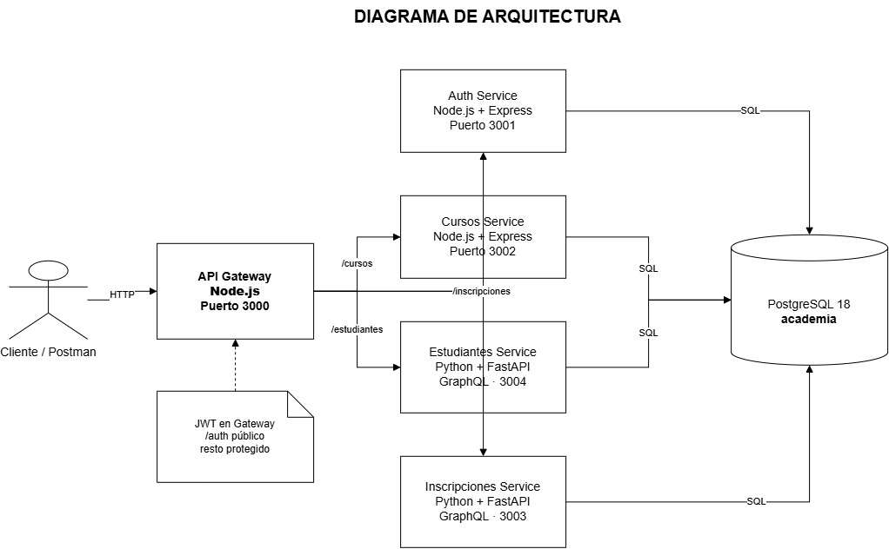
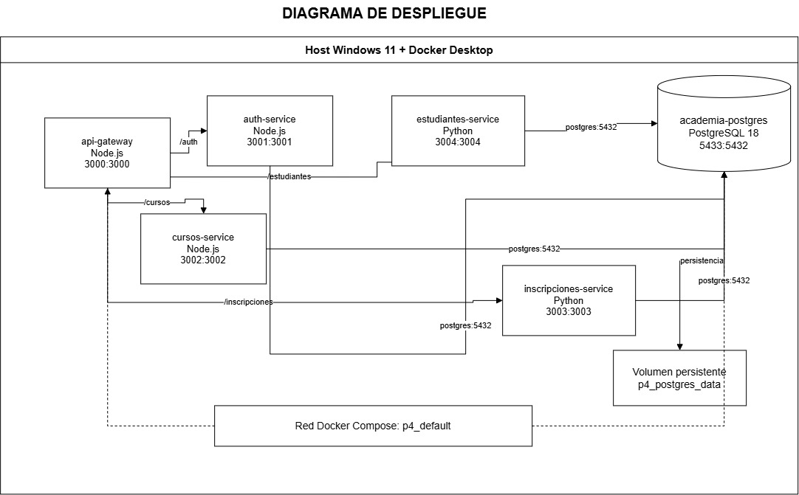
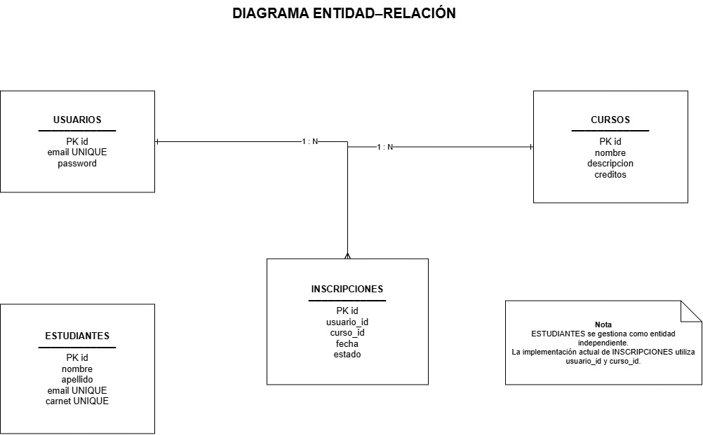

# P4 - Sistema de Gestión Académica basado en Microservicios

## 1. Descripción

Este proyecto implementa un sistema de gestión académica utilizando una arquitectura basada en microservicios.

El sistema permite gestionar:

- Autenticación de usuarios.
- Cursos académicos.
- Estudiantes.
- Inscripciones a cursos.
- Protección de servicios mediante JWT.
- Comunicación mediante REST y GraphQL.
- Acceso centralizado mediante un API Gateway.

Los diferentes servicios fueron desarrollados utilizando Node.js y Python y se ejecutan de forma independiente mediante contenedores Docker.

---

## 2. Arquitectura del sistema

El proyecto está compuesto por los siguientes microservicios:

| Servicio | Tecnología | Puerto | Comunicación |
|---|---|---:|---|
| API Gateway | Node.js + Express | 3000 | HTTP |
| Auth Service | Node.js + Express | 3001 | REST |
| Cursos Service | Node.js + Express | 3002 | REST |
| Inscripciones Service | Python + FastAPI | 3003 | GraphQL |
| Estudiantes Service | Python + FastAPI | 3004 | GraphQL |
| PostgreSQL | PostgreSQL 18 | 5433 → 5432 | SQL |

Todas las solicitudes externas ingresan a través del API Gateway en el puerto `3000`.

El Gateway redirige las solicitudes hacia el microservicio correspondiente:

```text
Cliente / Postman
        |
        v
API Gateway :3000
        |
        +---- /auth -----------> Auth Service :3001
        |
        +---- /cursos ---------> Cursos Service :3002
        |
        +---- /inscripciones --> Inscripciones Service :3003
        |
        +---- /estudiantes ----> Estudiantes Service :3004
                                      |
                                      v
                                 PostgreSQL
```

El diagrama completo de arquitectura se encuentra en:

```text
documentacion/arquitectura.png
```

---

## 3. Tecnologías utilizadas

### Backend

- Node.js
- Express.js
- Python
- FastAPI
- GraphQL

### Base de datos

- PostgreSQL 18

### Seguridad

- JSON Web Token (JWT)
- bcrypt

### Infraestructura

- Docker
- Docker Compose

### Pruebas y documentación de API

- Postman
- GraphiQL

---

## 4. Estructura del proyecto

```text
P4/
│
├── auth-service/
│   ├── src/
│   │   ├── config/
│   │   ├── routes/
│   │   └── index.js
│   ├── Dockerfile
│   ├── package.json
│   └── .env
│
├── cursos-service/
│   ├── src/
│   │   ├── config/
│   │   ├── routes/
│   │   └── index.js
│   ├── Dockerfile
│   ├── package.json
│   └── .env
│
├── estudiantes-service/
│   ├── app/
│   │   ├── database.py
│   │   ├── main.py
│   │   └── schema.py
│   ├── Dockerfile
│   ├── requirements.txt
│   └── .env
│
├── inscripciones-service/
│   ├── app/
│   │   ├── database.py
│   │   ├── main.py
│   │   └── schema.py
│   ├── Dockerfile
│   ├── requirements.txt
│   └── .env
│
├── gateway/
│   ├── src/
│   │   └── index.js
│   ├── Dockerfile
│   └── package.json
│
├── database/
│   └── init.sql
│
├── documentacion/
│   ├── arquitectura.png
│   ├── despliegue.png
│   └── entidad-relacion.png
│
├── docker-compose.yml
└── README.md
```

---

# 5. Microservicios

## 5.1 Auth Service

El servicio de autenticación se encarga del registro e inicio de sesión de usuarios.

Tecnologías:

- Node.js
- Express
- PostgreSQL
- bcrypt
- JWT

Puerto:

```text
3001
```

### Registrar usuario

```http
POST /auth/register
```

Ejemplo:

```json
{
  "email": "admin@academia.com",
  "password": "123456"
}
```

### Iniciar sesión

```http
POST /auth/login
```

Ejemplo:

```json
{
  "email": "admin@academia.com",
  "password": "123456"
}
```

Al iniciar sesión correctamente se obtiene un JWT:

```json
{
  "mensaje": "Inicio de sesión correcto",
  "token": "JWT..."
}
```

---

# 5.2 Cursos Service

Microservicio encargado de gestionar los cursos académicos.

Tecnologías:

- Node.js
- Express
- PostgreSQL
- REST

Puerto:

```text
3002
```

### Listar cursos

```http
GET /cursos
```

### Crear curso

```http
POST /cursos
```

Ejemplo:

```json
{
  "nombre": "Software Avanzado",
  "descripcion": "Curso de arquitectura y microservicios",
  "creditos": 4
}
```

---

# 5.3 Estudiantes Service

Microservicio encargado de gestionar estudiantes.

Tecnologías:

- Python
- FastAPI
- GraphQL
- PostgreSQL

Puerto:

```text
3004
```

Endpoint mediante Gateway:

```http
POST /estudiantes
```

### Listar estudiantes

Consulta GraphQL:

```graphql
query {
  estudiantes {
    id
    nombre
    apellido
    email
    carnet
  }
}
```

### Crear estudiante

```graphql
mutation {
  crearEstudiante(
    nombre: "Carlos"
    apellido: "Lopez"
    email: "carlos@academia.com"
    carnet: "20260002"
  ) {
    id
    nombre
    apellido
    email
    carnet
  }
}
```

---

# 5.4 Inscripciones Service

Microservicio encargado de gestionar las inscripciones a los cursos.

Tecnologías:

- Python
- FastAPI
- GraphQL
- PostgreSQL

Puerto:

```text
3003
```

Endpoint mediante Gateway:

```http
POST /inscripciones
```

### Listar inscripciones

```graphql
query {
  inscripciones {
    id
    usuarioId
    cursoId
    estado
  }
}
```

### Crear inscripción

```graphql
mutation {
  crearInscripcion(
    usuarioId: 1
    cursoId: 1
  ) {
    id
    usuarioId
    cursoId
    estado
  }
}
```

---

# 6. API Gateway

El API Gateway proporciona un único punto de entrada para los clientes.

Puerto:

```text
3000
```

Las rutas utilizadas son:

```text
/auth
/cursos
/estudiantes
/inscripciones
```

El Gateway redirige cada solicitud al microservicio correspondiente.

---

# 7. Seguridad mediante JWT

El sistema utiliza JSON Web Tokens para proteger los recursos.

Las rutas de autenticación son públicas:

```text
/auth/register
/auth/login
```

Las demás rutas requieren un JWT válido.

Ejemplo del encabezado HTTP:

```http
Authorization: Bearer TOKEN
```

Si se intenta acceder a un recurso protegido sin token, el servidor responde:

```json
{
  "mensaje": "Token requerido"
}
```

El flujo de autenticación es:

```text
Usuario
   |
   | email + contraseña
   v
Auth Service
   |
   | genera JWT
   v
Cliente
   |
   | Authorization: Bearer JWT
   v
API Gateway
   |
   | valida JWT
   v
Microservicio
```

---

# 8. REST y GraphQL

El proyecto utiliza dos mecanismos de comunicación.

## REST

Se utiliza en:

```text
Auth Service
Cursos Service
```

Ejemplos:

```http
POST /auth/login
GET /cursos
POST /cursos
```

## GraphQL

Se utiliza en:

```text
Estudiantes Service
Inscripciones Service
```

GraphQL permite solicitar únicamente los campos necesarios y realizar consultas y mutaciones mediante un único endpoint por servicio.

---

# 9. Base de datos

El proyecto utiliza PostgreSQL 18.

Base de datos:

```text
academia
```

Las principales tablas son:

```text
usuarios
cursos
estudiantes
inscripciones
```

PostgreSQL se ejecuta dentro de Docker.

Puerto interno:

```text
5432
```

Puerto expuesto en el equipo:

```text
5433
```

La información se conserva mediante un volumen Docker:

```text
postgres_data
```

---

# 10. Docker

Todos los componentes del sistema pueden ejecutarse mediante Docker Compose.

Para construir las imágenes y levantar el sistema:

```bash
docker compose up --build
```

Para ejecutarlo en segundo plano:

```bash
docker compose up -d --build
```

Para comprobar los contenedores:

```bash
docker compose ps
```

Para detener el sistema:

```bash
docker compose down
```

No utilizar:

```bash
docker compose down -v
```

si se desea conservar la información almacenada en PostgreSQL, ya que la opción `-v` elimina los volúmenes.

---

# 11. Acceso al sistema

Una vez levantados los contenedores, el punto de entrada principal es:

```text
http://localhost:3000
```

Los servicios se encuentran disponibles en:

```text
Gateway:       localhost:3000
Auth:          localhost:3001
Cursos:        localhost:3002
Inscripciones: localhost:3003
Estudiantes:   localhost:3004
PostgreSQL:    localhost:5433
```

Para las pruebas normales se recomienda utilizar siempre el Gateway:

```text
localhost:3000
```

---

# 12. Contrato de servicios

El contrato de los servicios fue documentado utilizando Postman.

La colección incluye solicitudes para:

```text
Auth
├── Registrar usuario
└── Iniciar sesión

Cursos
├── Listar cursos
└── Crear curso

Estudiantes
├── Listar estudiantes
└── Crear estudiante

Inscripciones
├── Listar inscripciones
└── Crear inscripción
```

La colección utiliza:

```text
{{base_url}}
```

como URL base y:

```text
{{token}}
```

para almacenar el JWT.

El inicio de sesión guarda automáticamente el token para utilizarlo posteriormente en las rutas protegidas.

---

# 13. Principios SOLID

Durante el diseño del sistema se aplicaron conceptos relacionados con los principios SOLID.

## S - Single Responsibility Principle

Cada microservicio posee una responsabilidad específica.

```text
Auth Service
→ autenticación

Cursos Service
→ administración de cursos

Estudiantes Service
→ administración de estudiantes

Inscripciones Service
→ administración de inscripciones

API Gateway
→ punto de entrada y enrutamiento
```

Esto evita concentrar todas las funcionalidades en una única aplicación.

## O - Open/Closed Principle

La arquitectura permite agregar nuevos microservicios sin modificar completamente los servicios existentes.

Por ejemplo, podrían incorporarse posteriormente:

```text
notificaciones-service
pagos-service
reportes-service
```

y agregarse sus respectivas rutas al Gateway.

## L - Liskov Substitution Principle

Los componentes mantienen contratos de comunicación definidos mediante HTTP, REST y GraphQL.

Los clientes consumen los servicios mediante dichos contratos sin necesitar conocer los detalles internos de implementación.

## I - Interface Segregation Principle

Cada servicio expone únicamente las operaciones relacionadas con su responsabilidad.

Por ejemplo, el servicio de cursos no expone operaciones de autenticación y el servicio de autenticación no administra estudiantes.

## D - Dependency Inversion Principle

Los clientes no acceden directamente a cada microservicio para el flujo principal del sistema.

En su lugar utilizan el API Gateway como punto de entrada:

```text
Cliente
   |
   v
API Gateway
   |
   v
Microservicios
```

Esto reduce el acoplamiento entre los consumidores y la infraestructura interna.

---

# 14. Diagramas

A continuación se presentan los diagramas utilizados para documentar la arquitectura, el despliegue y el modelo de datos del sistema.

## 14.1 Diagrama de Arquitectura

El diagrama de arquitectura representa la interacción entre el cliente, el API Gateway, los diferentes microservicios y la base de datos PostgreSQL.

Se puede observar cómo el API Gateway funciona como punto de entrada único y distribuye las solicitudes hacia los servicios correspondientes.



---

## 14.2 Diagrama de Despliegue

El diagrama de despliegue representa la infraestructura utilizada para ejecutar el sistema mediante Docker.

Cada microservicio se ejecuta dentro de su propio contenedor y se comunica mediante la red creada por Docker Compose. PostgreSQL utiliza un volumen persistente para conservar la información.



---

## 14.3 Diagrama Entidad-Relación

El diagrama entidad-relación representa las principales entidades utilizadas por el sistema y las relaciones existentes entre ellas.

El modelo incluye las entidades relacionadas con usuarios, estudiantes, cursos e inscripciones.



---

# 15. Pruebas

Los servicios fueron probados mediante Postman.

Se verificaron los siguientes escenarios:

- Registro de usuario.
- Inicio de sesión.
- Generación de JWT.
- Rechazo de solicitudes sin token.
- Listado de cursos.
- Creación de cursos.
- Listado de estudiantes mediante GraphQL.
- Creación de estudiantes mediante GraphQL.
- Listado de inscripciones mediante GraphQL.
- Creación de inscripciones mediante GraphQL.
- Comunicación a través del API Gateway.
- Comunicación con PostgreSQL dentro de Docker.

---

# 16. Ejecución completa

Para ejecutar el proyecto:

### 1. Tener Docker Desktop iniciado

### 2. Ubicarse en la carpeta P4

```bash
cd P4
```

### 3. Construir y ejecutar

```bash
docker compose up --build
```

### 4. Verificar el Gateway

```http
GET http://localhost:3000/
```

Respuesta esperada:

```json
{
  "servicio": "api-gateway",
  "estado": "funcionando"
}
```

### 5. Iniciar sesión

```http
POST http://localhost:3000/auth/login
```

### 6. Utilizar el JWT

Para consumir los endpoints protegidos:

```http
Authorization: Bearer TOKEN
```

---

# 17. Conclusión

El proyecto demuestra la implementación de una arquitectura de microservicios utilizando diferentes tecnologías y mecanismos de comunicación.

La solución combina servicios desarrollados con Node.js y Python, comunicación REST y GraphQL, autenticación mediante JWT, persistencia con PostgreSQL, un API Gateway como punto de entrada y Docker Compose para administrar la infraestructura.

La separación de responsabilidades permite mantener los componentes desacoplados y facilita la extensión futura del sistema.
---

# PRACTICA 8 - GitOps, entrega progresiva y seguridad de la cadena de suministro

La Práctica 8 implementa un flujo GitOps para el sistema de microservicios utilizando infraestructura declarativa, Helm, ArgoCD, entrega progresiva mediante canary releases y controles de seguridad de la cadena de suministro.

## Componentes principales

- Terraform para infraestructura del namespace sa-p8.
- ResourceQuota y LimitRange.
- ServiceAccounts y RBAC.
- Helm para empaquetado de los microservicios.
- ArgoCD como componente encargado de aplicar cambios al clúster.
- Repositorio GitOps independiente.
- Argo Rollouts para entrega progresiva.
- AnalysisTemplate para validar la salud del Gateway.
- Kyverno para políticas de admisión.
- Trivy para análisis de vulnerabilidades.
- SBOM mediante Syft.
- Firma y verificación de imágenes mediante Cosign.
- Pruebas smoke, integración y carga mediante k6.
- Sealed Secrets para evitar almacenar secretos en texto plano.

## Flujo GitOps

`	ext
Git Tag / Release
        |
        v
GitHub Actions
        |
        +--> Helm lint / template
        |
        +--> Trivy
        |
        +--> Build de imágenes
        |
        +--> SBOM
        |
        +--> Cosign sign + verify
        |
        +--> k6
        |
        v
Actualización automática del repositorio GitOps
        |
        v
Pull Request
        |
        v
Merge
        |
        v
ArgoCD
        |
        v
Kubernetes / AKS
        |
        v
Argo Rollouts
        |
        +--> 20%
        +--> 50%
        +--> 80%
        +--> 100%
`",
        ",
        

El pipeline valida los manifiestos Helm y realiza análisis de seguridad antes de publicar las imágenes.

Las imágenes utilizan versiones explícitas y no latest.

Se generan SBOM mediante Syft y las imágenes son firmadas y verificadas mediante Cosign.

Kyverno aplica políticas para:

- Prohibir la etiqueta latest.
- Exigir requests y limits de CPU y memoria.
- Exigir ejecución de los workloads como usuario no root.

Los secretos de aplicación se gestionan mediante Sealed Secrets y no se almacenan en texto plano dentro del repositorio GitOps.

## Entrega progresiva

El Gateway utiliza una estrategia canary con etapas del 20%, 50%, 80% y 100%.

Las etapas intermedias cuentan con AnalysisRuns que consultan el endpoint /health del servicio canary.

Cuando un análisis falla, Argo Rollouts puede abortar la actualización y devolver el tráfico a la versión estable.

## Evidencia de reversión

Durante la validación se utilizó una revisión defectuosa del Gateway. El AnalysisRun detectó errores consecutivos contra el servicio canary y Argo Rollouts abortó la actualización, restaurando el selector canary a la versión estable y reduciendo la réplica defectuosa.

Esta evidencia se conserva en el historial de Rollouts y forma parte de la demostración de entrega progresiva y reversión automática.

## Repositorios

La implementación de la Práctica 8 se encuentra dentro de P8/.

La configuración GitOps independiente se encuentra en el repositorio Practica-SA-P8-GitOps.
